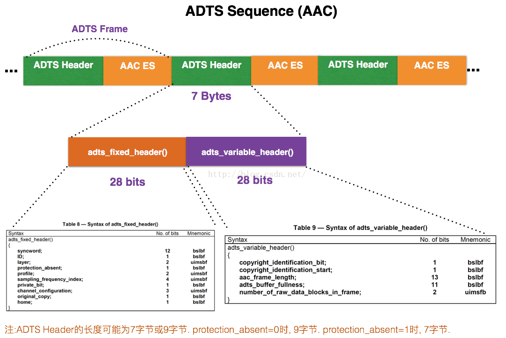

# MediaStream
[TOC]

Version0.1:2019.4.22


## 一：说明

视频和音频的流媒体相关。


## 二：项目结构

- **FfmpegMedia：** FFmpeg相关的封装、解封装、视频解码、音频解码；
- **MediaStream：** 无


## 三：项目说明

### 3.1 Demux

#### 3.1.1 Demux视频

- 视频VPS/SPS/PPS等相关信息保存在FFmpeg的extradata结构体中。

  H264保存的是 `AVCDecoderConfiguration`:

  ```c++
  aligned(8) class AVCDecoderConfigurationRecord {
      unsigned int(8) configurationVersion = 1;
      unsigned int(8) AVCProfileIndication;
      unsigned int(8) profile_compatibility;
      unsigned int(8) AVCLevelIndication;
      bit(6) reserved = ‘111111’b;
      unsigned int(2) lengthSizeMinusOne;
      bit(3) reserved = ‘111’b;
      unsigned int(5) numOfSequenceParameterSets;
      for (i=0; i< numOfSequenceParameterSets; i++) {
          unsigned int(16) sequenceParameterSetLength ;
          bit(8*sequenceParameterSetLength) sequenceParameterSetNALUnit;
      }
      unsigned int(8) numOfPictureParameterSets;
      for (i=0; i< numOfPictureParameterSets; i++) {
          unsigned int(16) pictureParameterSetLength;
          bit(8*pictureParameterSetLength) pictureParameterSetNALUnit;
      }
  }
  ```

  HEVC保存的是`HEVCDecoderConfiguration`:

  ```c++
  // The CodecPrivate syntax shall follow the
  // syntax of HEVCDecoderConfigurationRecord
  // defined in ISO/IEC 14496-15.
  //
  // The number zero (0) shall be written to
  // the configurationVersion variable until
  // official finalization of 14496-15, 3rd ed.
  //
  // After its finalization, this field and the
  // following CodecPrivate structure shall
  // follow the definition of the
  // HEVCDecoderConfigurationRecord in 14496-15.
  
  unsigned int(8)  configurationVersion;
  unsigned int(2)  general_profile_space;
  unsigned int(1)  general_tier_flag;
  unsigned int(5)  general_profile_idc;
  unsigned int(32) general_profile_compatibility_flags;
  unsigned int(48) general_constraint_indicator_flags;
  unsigned int(8)  general_level_idc;
  bit(4) reserved = ‘1111’b;
  unsigned int(12) min_spatial_segmentation_idc;
  bit(6) reserved = ‘111111’b;
  unsigned int(2)  parallelismType;
  bit(6) reserved = ‘111111’b;
  unsigned int(2)  chromaFormat;
  bit(5) reserved = ‘11111’b;
  unsigned int(3)  bitDepthLumaMinus8;
  bit(5) reserved = ‘11111’b;
  unsigned int(3)  bitDepthChromaMinus8;
  bit(16) avgFrameRate;
  bit(2)  constantFrameRate;
  bit(3)  numTemporalLayers;
  bit(1)  temporalIdNested;
  unsigned int(2) lengthSizeMinusOne;
  unsigned int(8) numOfArrays;
  for (j=0; j < numOfArrays; j++) {
  	bit(1) array_completeness;
  	unsigned int(1)  reserved = 0;
  	unsigned int(6)  NAL_unit_type;
  	unsigned int(16) numNalus;
  	for (i=0; i< numNalus; i++) {
   		unsigned int(16) nalUnitLength;
  		bit(8*nalUnitLength) nalUnit;
      }
  }
  ```

- Demux出的视频帧开始4bytes为帧长度，需要替换为 **start code: 0x00, 0x00, 0x00, 0x01** ;

- 关键帧由AVPacket的flags字段标志：`AV_PKT_FLAG_KEY` ；

- NUAL判断：

  ```c++
  // H264
  nal_type = (0x1f & byte)
  
  // HEVC
  nal_type = (byte & 0x7E)>>1)
  ```

- HEVC的关键帧之前会带有VPS/SPS/PPS/SEI_PREFIX，需要跳过。

#### 3.1.2 Demux音频

- 音频解码相关信息保存在extradata中。

  AAC保存的是 `AudioSpecificConfig`:

  ```c++
  | AAC Profile 5bits | 采样率 4bits | 声道数 4bits | 其他 3bits |
  ```

- FFmpeg出来的音频帧是不带ADTS的，因此需要在每帧前加ADTS头：

  

  ### 3.2 Mux

  - 解码数据：解码数据与Demux存在对应关系，保存在extradata中；

  - 时间戳：Mux时间戳需要自己打，注意FFmpeg的时间戳转换问题。

  

  

  

  参考：

  [AAC ADTS格式分析](https://www.cnblogs.com/zhangxuan/p/8809245.html)

  

  